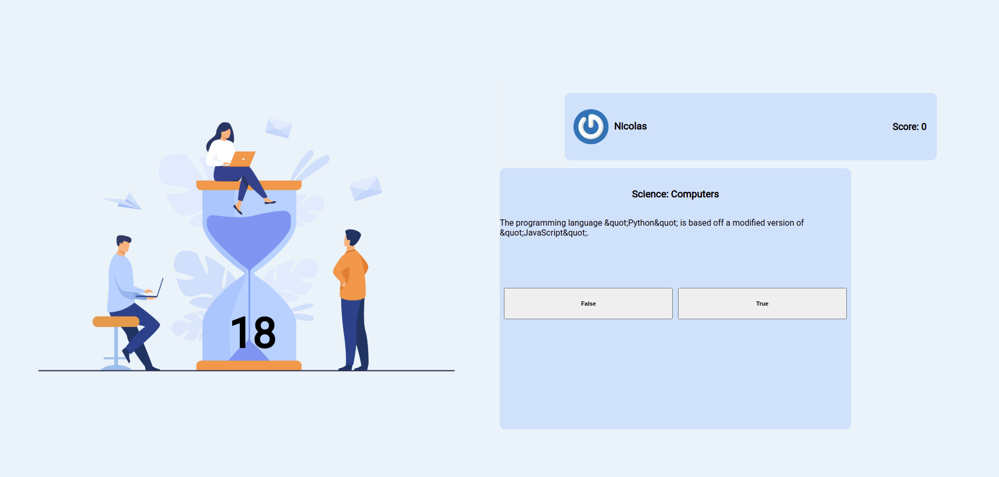

### Trivia GAME

Projeto desenvolvido em parceria com o time...  
Rodrigo Marchi Silva > [linkedin](https://www.linkedin.com/in/rodrigo-marchi-23a2031b7/)  
Alexandre Fortes > [linkedin](http://linkedin.com/in/alexandremarquesf)  
Luiz Gustavo > [linkedin](https://www.linkedin.com/in/luizsmatos/) 
Matheus Soares >[linkedin](https://www.linkedin.com/in/mateeus-soarees/)  
Nicolas Johnson > [linkedin](https://www.linkedin.com/in/nicolas-johnson-279662210/)  

Desafio do curso de FullStack Developer da TRYBE https://www.betrybe.com/

[DEMO](linke)

## Tech em uso

[React] Aplication  
Gerenciamento de estado com [Redux]  
Uso de API externas com0...
  - A [API do Trivia](https://opentdb.com/api_config.php)
  - A [API do Gravatar](https://br.gravatar.com/site/implement/images/)

  *Testes
    - [Linter] para controle da qualidade do codigo.
    - [CYPRESS] com execução de testes por requisito

# Habilidades desenvolvidas.

-Criar um store Redux em aplicações React  

-Criar reducers no Redux em aplicações React  

-Criar actions no Redux em aplicações React  

-Criar dispatchers no Redux em aplicações React  

-Conectar Redux aos componentes React  

-Criar actions assíncronas na aplicação React que faz uso de Redux.  

# O que foi desenvolvido.

Um jogo de perguntas e respostas baseado no jogo **Trivia** _(tipo um show do milhão americano rs)_ utilizando _React e Redux_, desenvolvido em grupo suas funcionalidades de acordo com as demandas definidas em um quadro _Kanban_. Para viver um cenário mais próximo do mercado de trabalho, foi criado uma cópia desse quadro para utilizar com o time. Foi de suma importância a organização d grupo utilizando o quadro para maior eficiência e para que se minimizasem os conflitos que a união de vários códigos trouxe. A partir dessas demandas, obtivemos uma aplicação onde a pessoa usuária pode:

  - Logar no jogo e, se o email tiver cadastro no site [Gravatar](https://pt.gravatar.com/), ter sua foto associada ao perfil de usuária.
  - Acessar a página referente ao jogo, onde se deve escolher uma das respostas disponíveis para cada uma das perguntas apresentadas. A resposta deve ser marcada antes do contador de tempo chegar a zero, caso contrário a resposta é considerada errada.
  - Ser redirecionada, após 5 perguntas respondidas, para a tela de score, onde o texto mostrado depende do número de acertos.
  - Visualizar a página de ranking, se quiser, ao final de cada jogo.

